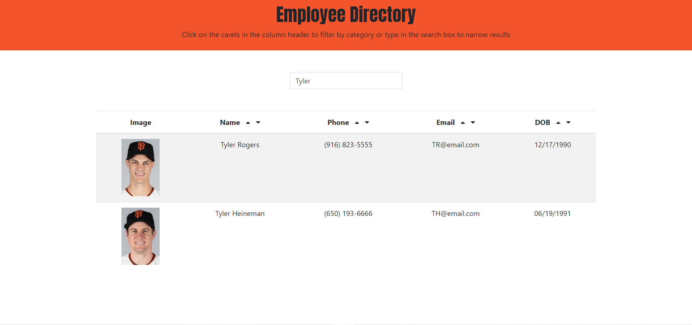

# Employee Directory

[](https://github.com/dwyl/esta/issues)


## Description
Employee directory is an application that displays a searchable and sortable list of individuals.



## Table of Contents
* [Background](#background)
* [Approach](#approach)
* [Technology](#technology)
* [Site](#site)
* [License](#license)
* [Contributing](#contributing)
* [Questions](#questions)
* [Authors](#authors)


## Background

Employee Directory was built using React. It features UI that has been separated into components, managed component state, and it responds to user events.

Acceptance criteria for this app is as follows:

```
* Sort the table by at least one category

* Filter the users by at least one property.

```

## Approach

The project featured the below areas of focus:
1) Displaying employees that meet the search criteria
2) Sorting employees to be ascending or descending based on different criteria (i.e. columns)

### Displaying search results

When a user types something into the search field, the list of employees will dynamically render to show only those employees that meet the search criteria. Criteria will match any of the columns, with exception to the image column. 

The above functionality was accomplished primarily through the use of the conditional below:

```
if (value) {
            for (let i = 0; i < employeeState.length; i++) {
                if (employeeState[i].name.toLowerCase().includes(lowerValue) || employeeState[i].email.toLowerCase().includes(lowerValue) || employeeState[i].dob.includes(value) || employeeState[i].phone.includes(value)) {
                    newArray.push(employeeState[i])
                }
            }
            setListEmployee(newArray)
        }
        else {
            setListEmployee(employeeState)
        }
```

Effectively, we capture the value of what the user enters into the search field and use this to see if various key : value pairs meet the criteria. If any key : value pair for a given employee meets the criteria, we push to a new array and ultimately update state with this new array.

### Sorting employees to be ascending or descending

Users can sort by various criteria by clicking on the ascending or descending carets in the header of each column. Below is the code for rendering the page in ascending order:

```
    const selectionSort = (items, input) => {
        var newArray = items
        var len = newArray.length;
        var min;

        for (var i = 0; i < len; i++) {
            min = i;
            for (var j = i + 1; j < len; j++) {
                if (newArray[j][input] < newArray[min][input]) {
                    min = j;
                }
            }
            if (i !== min) {
                swap(items, i, min);
            }
        }
        return newArray;
    }
```
In the code above, we base our comparison on an input parameter which equals the column title. As there are only 12 employees, we use a simple selection sort to perform our sorting.

## Technology

* [html5](https://developer.mozilla.org/en-US/docs/Web/Guide/HTML/HTML5)
* [CSS](https://developer.mozilla.org/en-US/docs/Web/CSS/Reference)
* [JS](https://developer.mozilla.org/en-US/docs/Web/JavaScript)
* [Bootstrap](https://getbootstrap.com/)
* [React](https://reactjs.org/)

## Site

* [See Live Site](https://cofchips.github.io/employee_directory/)

## License
MIT

## Contributing
Contributions are welcome. Please contact for further details.

## Questions
If you have any questions regarding this project, please email qiwei.mod@gmail.com.

## Authors

* **CHRISTOPHER LEE** 

- [Link to Github](https://github.com/CofChips)
- [Link to LinkedIn](https://www.linkedin.com/in/christophernlee/)
